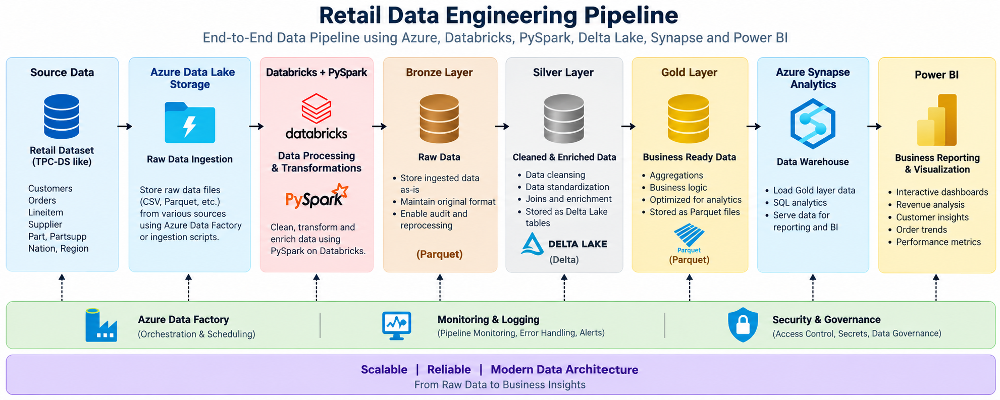

# Retail Data Engineering Pipeline

An end-to-end data engineering project built using Azure Data Lake Storage, Azure Databricks, PySpark, Delta Lake, Azure Synapse Analytics, and Power BI.

## Architecture

