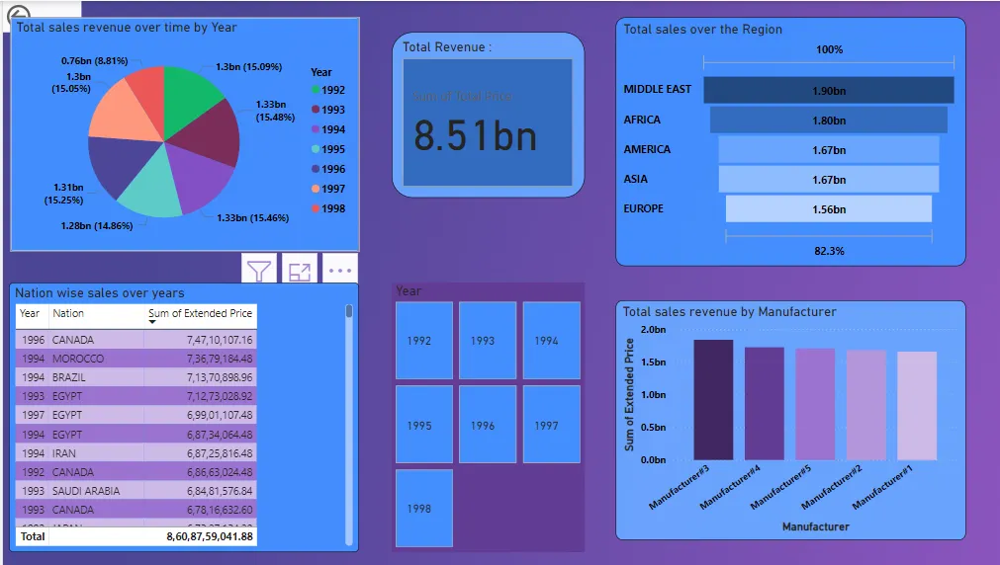
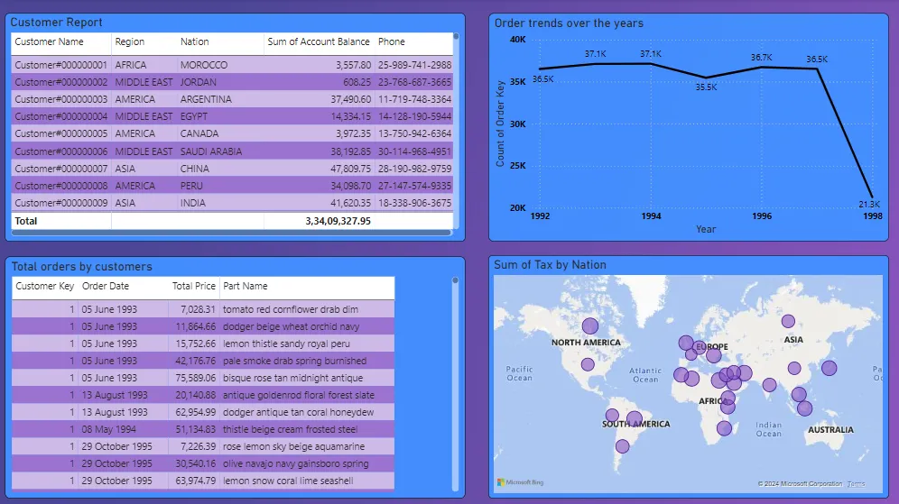
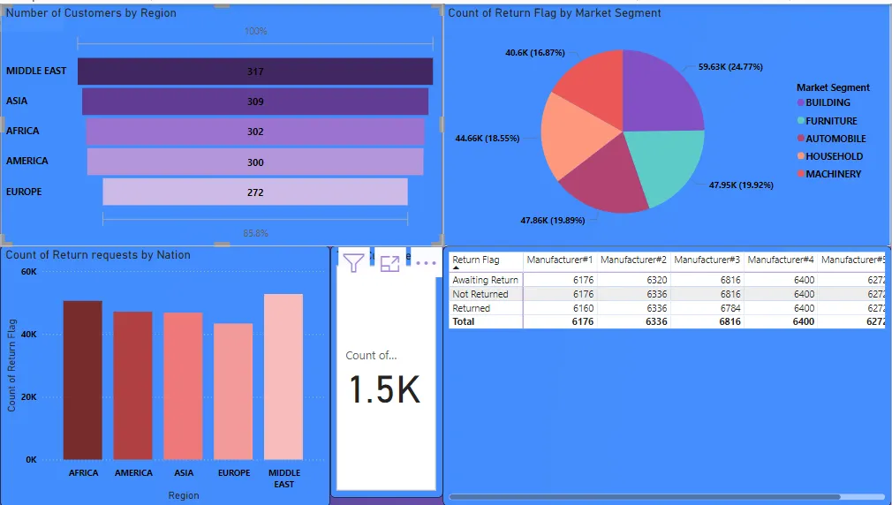
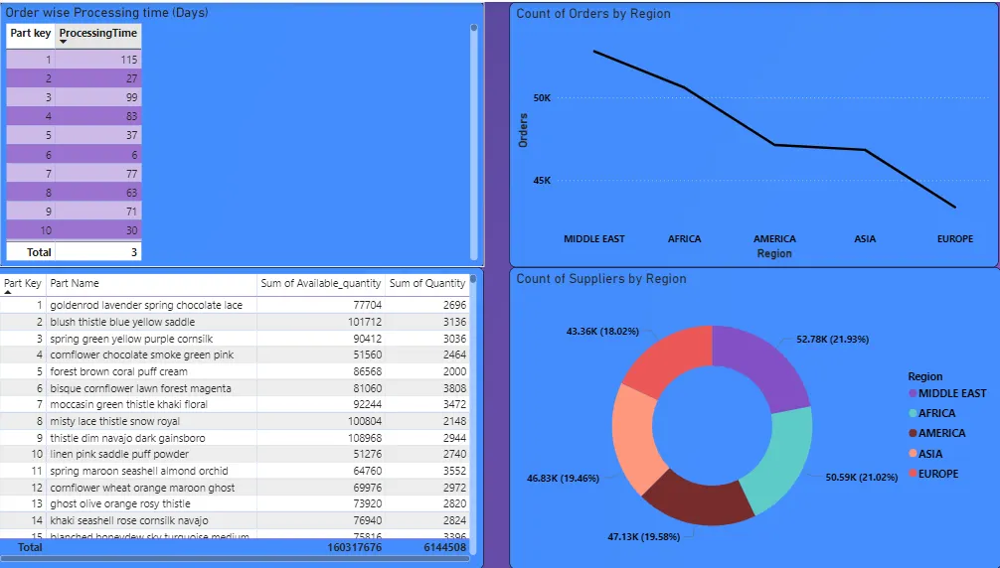

# Power BI Dashboard

The Gold layer of the data pipeline is consumed for business reporting and visualization in Power BI.

## Dashboard Areas

- Revenue Analysis
- Customer Analysis
- Order Trends
- Returns Analysis
- Business Insights

## Revenue Analysis

## Customer and Order Analysis

## Returns Analysis

## Business Insights

## Data Flow

Gold Layer
↓
Azure Synapse Analytics
↓
Power BI
↓
Business Dashboard
